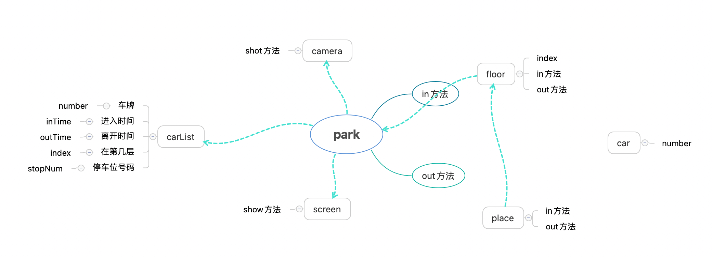

# 设计模式解析与实战

> 摘要: 了解设计模式，了解设计模式分类，不同场景应用不同设计模式

app.diagrams.net

## SOLID

开闭原则(OPC): 开-拓展 闭-修改

单一职责原则(SRP)：模块、功能独立，单一职责

依赖倒置原则(DIP)：上层不应该依赖下层的实现

接口隔离原则(ISP)：接口的独立

里氏替换原则(LSP)：子类在系统中可以用来替代父类

## 面试题

某停车场，分3层，每层100车位。每个车位都能监控到车辆的驶入和离开，车辆进入前，显示每层的空余车辆数量；车辆进入时，摄像头可识别车牌号和时间；车辆出来时，出口显示器显示车牌号和停车时长。

设计一套系统

> 步骤：
>
> 1分词：都有哪些物品或场所；再分析隐藏的物品或场所
>
> 2画图：根据分词画图，并标出关系，以及各自的方法和属性
>
> 3根据图写代码

停车场：驶入方法、使出方法、使用相机，使用显示器

相机：拍照

显示器：显示时间

层：层索引

停车位：驶入方法，使出方法

车：车牌

账单：记录车牌，进入时间，离开时间，停留层, 停车位号

链接地址：https://github.com/MrRetro/html-css-js/blob/master/designMode/park.js
